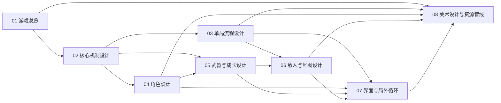

# 幸存者设计文档索引与管线

## 文档拆分
这套文档按“先定目标，再定规则，再定流程，再填内容，最后接界面与局外循环”的顺序拆分。每篇文档只负责一个层级，后续修改时先改上游文档，再同步受影响的下游文档。

| 编号 | 文档 | 负责回答的问题 | 上游依赖 | 下游输出 |
| --- | --- | --- | --- | --- |
| 01 | [游戏总览](./01-游戏总览.md) | 这款游戏是什么，做到什么范围 | 无 | 02-07 的共同边界 |
| 02 | [核心机制设计](./02-核心机制设计.md) | 战斗与成长按什么规则运行 | 01 | 03、05、06、07 |
| 03 | [单局流程设计](./03-单局流程设计.md) | 一局从开场到结算怎样推进 | 01、02 | 06、07、验收用例 |
| 04 | [角色设计](./04-角色设计.md) | 可玩角色如何区分与解锁 | 01、02 | 05、07 |
| 05 | [武器与成长设计](./05-武器与成长设计.md) | 武器、被动、进化与升级池如何运作 | 02、04 | 03、06、07 |
| 06 | [敌人与地图设计](./06-敌人与地图设计.md) | 地图结构、敌人职责、刷怪节奏如何安排 | 02、03、05 | 07、数值测试 |
| 07 | [界面与局外循环](./07-界面与局外循环.md) | 菜单、HUD、结算与解锁怎样闭环 | 01-06 | 交互实现与验收 |
| 08 | [美术设计与资源管线](./08-美术设计与资源管线.md) | 像素风美术如何定义、生成、筛选和落地 | 01、03、04、06、07 | 资源制作与统一审美 |

## 依赖关系
上游文档定义边界，下游文档承接细节。`01` 和 `02` 不稳定时，不应直接扩写角色、敌人和界面，否则很容易反复返工。

## 维护管线
修改设计时，按“先源头、后传播”的顺序处理。这样能避免不同文档里对同一个规则出现两套写法。

1. 玩法目标、平台、版本范围变更时，先修改 `01`，再检查 `02-07` 是否仍然成立。
2. 升级规则、构筑上限、进化条件、胜负条件变更时，先修改 `02`，再同步 `03`、`05`、`06`、`07`。
3. 单局时长、Boss节点、时间轴压力变更时，先修改 `03`，再同步 `06` 与 `07`。
4. 角色新增或重做时，先修改 `04`，再同步 `05` 中的联动和 `07` 中的解锁展示。
5. 武器、被动、进化分支调整时，先修改 `05`，再同步 `03` 的成型节奏、`06` 的敌人克制关系和 `07` 的面板信息。
6. 敌人职责、地图结构、刷怪表调整时，先修改 `06`，再回看 `03` 的时间轴是否仍然流畅。
7. 菜单、HUD、结算、存档规则变更时，直接修改 `07`，只在涉及玩法规则时回溯上游文档。
8. 角色外观、敌人形象、地图氛围、UI风格和资源生成流程变更时，先修改 `08`，再检查 `04`、`06`、`07` 的展示是否需要同步。

## 实施顺序
设计文档可以直接对应开发阶段。前一阶段的输入不稳定时，不建议启动后一阶段的实现。

| 阶段 | 核心工作 | 主参考文档 | 交付结果 |
| --- | --- | --- | --- |
| 阶段一 | 冻结题材、平台、版本边界和成功标准 | 01 | 可统一认知的产品范围 |
| 阶段二 | 固定战斗循环、成长规则、状态机和胜负条件 | 02 | 可编码的玩法骨架 |
| 阶段三 | 确定 12 分钟时间轴、事件节点和结算逻辑 | 03 | 可验证的单局流程 |
| 阶段四 | 填充角色、武器、被动、进化、敌人和地图数据 | 04、05、06 | 可游玩的内容配置表 |
| 阶段五 | 接入菜单、HUD、升级面板、宝箱面板和解锁系统 | 07 | 可完整跑通的前后端界面流 |
| 阶段六 | 固定像素风规范，建立 `nanobanana` 资源生成与筛选管线 | 08 | 可持续扩产的美术资源流程 |
| 阶段七 | 根据验收场景回测流程断点、成长速度和解锁节奏 | 03、05、06、07、08 | 可汇报、可演示的课程方案 |

## 使用方式
需要新增内容时，不从整合版开始写，而是直接进入对应编号文档。需要输出汇报稿时，再从这些分文档回收内容，整理成展示版或答辩版材料。
