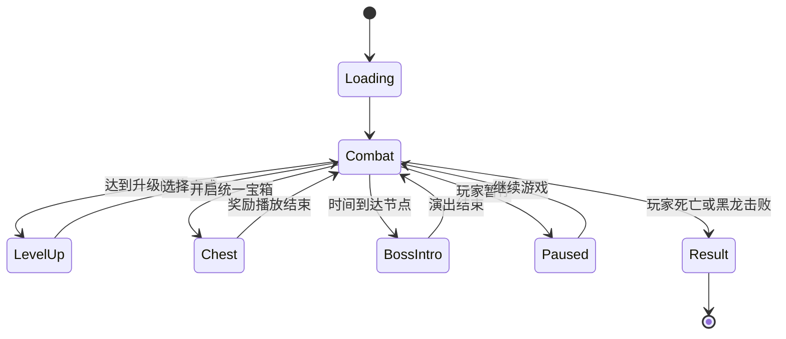

# 02 核心机制设计

## 核心循环
单局战斗的核心循环固定为“移动生存 -> 自动攻击 -> 击杀敌人 -> 拾取经验 -> 等级提升 -> 选择强化 -> 继续生存”。这条循环必须在开局很短时间内就让玩家感受到成长反馈。

角色不进行手动瞄准，普通攻击全部自动释放。玩家的主要决策放在走位、升级取舍、精英追击、宝箱进化和终局收尾上。

| 环节 | 输入 | 系统处理 | 输出 |
| --- | --- | --- | --- |
| 移动 | `WASD` | 更新角色位置、碰撞和拾取范围 | 脱离包围、调整站位 |
| 自动攻击 | 时间间隔或条件触发 | 按武器规则生成投射物或近战判定 | 造成伤害并清怪 |
| 击杀掉落 | 敌人生命归零 | 普通敌人掉经验晶体，精英或Boss掉统一宝箱，稀有回复结晶单独掉落 | 形成成长资源 |
| 升级选择 | 经验达到阈值 | 暂停战斗并生成三选一 | 补充或强化构筑 |
| 宝箱结算 | 击败精英或中段Boss | 触发统一开箱逻辑并检查进化条件 | 形成阶段跃迁 |

## 战斗规则
战斗规则追求高可读性，而不是高操作门槛。怪群密度可以高，但每个系统都要足够直接，让玩家明白为什么自己会死、为什么自己会变强。

| 系统 | 规则 | 设计目的 |
| --- | --- | --- |
| 生命值 | 角色受击扣除生命，生命归零立即失败 | 保持单局紧张感 |
| 自动攻击 | 武器按自身冷却和判定逻辑自动释放 | 把注意力集中在走位与构筑 |
| 经验拾取 | 经验晶体必须靠近拾取，不自动全图吸附 | 让路径选择更有意义 |
| 暂停逻辑 | 升级面板和宝箱面板弹出时暂停战斗 | 保证选择过程清晰 |
| 战场缓冲 | 稀有回复结晶只作为临时缓冲，不改变主循环 | 保持生存压力 |

## 成长规则
成长系统采用“三选一 + 统一宝箱进化”的双层结构。升级负责平滑成长，宝箱负责阶段跃迁，两者一起支撑 12 分钟的节奏。

| 模块 | 规则 | 约束 |
| --- | --- | --- |
| 构筑上限 | 最多 4 武器与 4 被动 | 控制信息量和课程复杂度 |
| 武器等级 | 基础武器最高 5 级 | 满级后等待宝箱进化 |
| 被动等级 | 基础被动最高 5 级 | 负责放大构筑方向 |
| 选项池 | 前期轻度偏向初始武器，后期偏向已持有项和联动件 | 保证开局成型与中后期收束 |
| 补位逻辑 | 有效强化不足 3 项时，用魔晶补位 | 不出现空白升级卡 |
| 宝箱进化 | 先结算进化，再结算随机等级 | 保证关键跃迁优先级 |

## 状态机
核心玩法必须有清楚的运行状态，避免升级、Boss 演出和结算互相打断。实现时可抽象成有限状态机。

## 平衡边界
平衡重点不在绝对数值，而在不同系统之间不要互相打架。只要边界稳定，后续伤害、范围和刷新率都可以继续细调。

1. 普通升级负责平滑增长，不能替代宝箱进化的阶段爆发。
2. 精英、腐化术士和黑龙必须有独立存在感。
3. 角色差异只能改变构筑偏好，不能改变统一操作模型。
4. 局外解锁只扩展选择，不直接提高永久战力。
