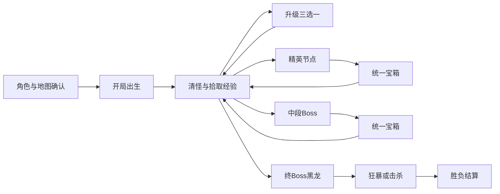

# 03 单局流程设计

## 流程总线
单局从角色与地图确认开始，结束于胜负结算。局内只保留三类核心反馈：经验晶体、统一宝箱、稀有回复结晶，不设置额外货币拾取，也不插入战斗外事件。

## 波次总表
单局固定为 12 分钟，并按 30 秒一格拆成 24 个时间段。前 3 分钟承担教学，中段让第一次失败合理落在 `6:00` 左右，后段再把压力推到终局黑龙。

| 时间 | 主敌人 | 压力点 | 节点与掉落 | 构筑目标 |
| --- | --- | --- | --- | --- |
| `0:00-0:30` | 少量酸液史莱姆 | 熟悉移动和自动攻击 | 无 | 拿到首批经验 |
| `0:30-1:00` | 史莱姆 + 零星魔狼 | 第一次贴脸追击 | 无 | 升到 2 级 |
| `1:00-1:30` | 史莱姆 + 魔狼 | 持续移动开始重要 | 无 | 找到绕圈路线 |
| `1:30-2:00` | 史莱姆 + 魔狼 | 经验掉落更稳定 | 无 | 拿到第 2 把武器或第 1 个被动 |
| `2:00-2:30` | 魔狼占比提高 | 追击更频繁 | 无 | 抬高初始武器等级 |
| `2:30-3:00` | 史莱姆 + 魔狼高混编 | 首个精英前预热 | 精英预警 | 保持血线完整 |
| `3:00-3:30` | 巨角魔狼 + 少量杂兵 | 学会追击精英 | 击杀后掉统一宝箱 | 体验首次开箱 |
| `3:30-4:00` | 史莱姆 + 魔狼回落 | 短暂回稳 | 无 | 补第二件组件 |
| `4:00-4:30` | 骷髅弓手加入 | 首次远程压制 | 无 | 形成 2 武器框架 |
| `4:30-5:00` | 弓手增加 | 走位路线被切割 | 无 | 补第 2 被动或第 3 武器 |
| `5:00-5:30` | 近远混编怪群 | 双线压迫形成 | 无 | 保住核心构筑 |
| `5:30-6:00` | 混编怪群 + 场地法阵预告 | 中段Boss前摇 | Boss 预警 | 第一局理想危险区 |
| `6:00-6:30` | 腐化术士 | 法阵弹幕 + 少量召唤 | 击败后掉统一宝箱 | 完成首次高压战 |
| `6:30-7:00` | 弓手 + 杂兵回归 | 战场节奏重建 | 无 | 重整血量与站位 |
| `7:00-7:30` | 石甲魔像加入 | 厚怪开始堵路 | 无 | 补满 4 武器 |
| `7:30-8:00` | 固定精英 + 魔像混编 | 突进与堵路叠加 | 击杀精英掉统一宝箱 | 争取首次进化 |
| `8:00-8:30` | 魔像 + 弓手 | 高血量拖长战线 | 无 | 补第 3 个被动 |
| `8:30-9:00` | 魔像 + 弓手 + 魔狼 | 中后期压力成型 | 无 | 补第 4 个被动 |
| `9:00-9:30` | 精英循环 + 厚怪混编 | 后段冲刺开始 | 击杀精英掉统一宝箱 | 追求第二次进化条件 |
| `9:30-10:00` | 厚怪混编 + 再次精英压场 | 容错明显下降 | 约 `9:45` 再掉统一宝箱 | 做好终局准备 |
| `10:00-10:30` | 厚怪高峰 | 黑龙前最后压力 | 黑龙预警 | 维持完整构筑 |
| `10:30-11:00` | 诅咒黑龙 + 少量厚怪 | 吐息与俯冲首次登场 | 不再刷新精英 | 从清怪转为压Boss |
| `11:00-11:30` | 黑龙 + 暗影召唤物 | 输出路线被干扰 | 无 | 稳定处理召唤物 |
| `11:30-12:00` | 黑龙压场强化 | 招式节奏更紧 | 无 | 收尾或准备狂暴 |

## 节点规则
`3:00` 的巨角魔狼是教学型精英，`6:00` 的腐化术士是首个理解门槛，`10:30` 的诅咒黑龙负责最终收束。`9:00` 以后进入后段冲刺，精英以 45 秒节奏压缩构筑窗口，但黑龙登场后不再继续刷新精英。

| 节点 | 触发条件 | 核心作用 | 后果 |
| --- | --- | --- | --- |
| 首个精英 | `3:00` 到达 | 教玩家追击精英与开箱 | 掉统一宝箱 |
| 中段Boss | `6:00` 到达 | 形成第一局最合理失败点 | 掉统一宝箱并抬高后续压力 |
| 后段精英循环 | `9:00` 后每 45 秒 | 压缩构筑成型时间 | 连续提供统一宝箱 |
| 终Boss黑龙 | `10:30` 到达 | 终局主威胁，不切独立Boss房 | 不再刷新精英 |
| 狂暴阶段 | `12:00` 时黑龙未死 | 拉高最后压迫 | 继续战斗直到玩家或黑龙倒下 |

## 宝箱规则
所有宝箱外观和表现完全一致。节奏差异只来自掉落时机和开箱结算结果。

1. 精英与腐化术士会掉落统一宝箱，诅咒黑龙不掉宝箱，击杀后直接进入胜利结算。
2. 开箱时先检查当前所有可进化武器。如果存在满足条件的武器，本箱只负责进化，不再结算额外升级。
3. 同一个宝箱允许连续进化多件武器。没有分支冲突的进化自动完成，有双分支冲突时再弹出选择。
4. 如果本箱没有可进化项，再结算随机升级总量。总量为 `1-5` 级，概率固定为 `10% / 20% / 40% / 20% / 10%`。
5. 随机升级只会命中当前持有且未满级的武器或被动，允许重复命中同一项，已满级项目会被排除。

## Boss规则
中段Boss和终Boss都采用单阶段设计，不做切形态。区别只在战场职责和压迫密度。

| Boss | 核心技能 | 战场作用 |
| --- | --- | --- |
| 腐化术士 | 法阵弹幕、短时召唤、远程骚扰 | 把玩家第一次完整推入高压战 |
| 诅咒黑龙 | 扇形吐息、俯冲扑击、暗影召唤 | 作为终局主威胁，逼迫玩家在原地图完成收尾 |

## 事件优先级
当多个事件同时触发时，系统按统一顺序处理，避免演出、升级和开箱互相打断。

1. 胜负判定优先于其他事件。
2. Boss 登场演出优先于普通升级弹窗。
3. 宝箱开启优先于普通刷怪，但低于胜负判定。
4. 升级面板高于普通怪物生成。
5. 稀有回复结晶只作为战场缓冲，不改变主循环结构。

## 结算规则
胜利和失败都进入统一结算界面。区别不在流程，而在奖励档位和展示语义。

| 结果 | 触发条件 | 奖励构成 | 页面反馈 |
| --- | --- | --- | --- |
| 失败 | 生命归零 | 存活时间 + 击杀数 + 精英击败 + 腐化术士击败奖励 | 展示本局卡点与成长进度 |
| 胜利 | 诅咒黑龙击败 | 失败奖励全部内容 + 黑龙击败奖励 + 首次通关奖励 | 展示通关、解锁和最高记录 |
