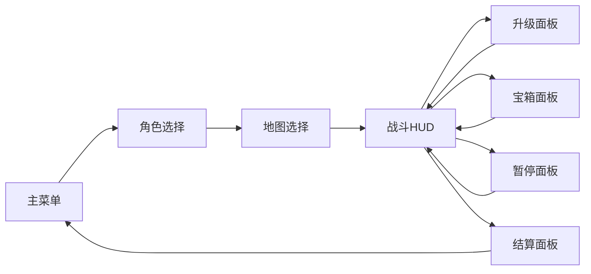

# 07 界面与局外循环

## 界面结构
首版仍保留主菜单、角色选择、地图选择、战斗 HUD、升级面板、宝箱面板、暂停面板和结算面板。界面任务不是堆信息，而是把 [03](./03-单局流程设计.md) 和 [05](./05-武器与成长设计.md) 已经冻结的规则清楚呈现出来。

## HUD与面板
| 界面 | 必须显示的内容 | 玩家操作 | 设计要点 |
| --- | --- | --- | --- |
| 主菜单 | 开始游戏、图鉴、最高记录 | 鼠标或 `Enter` | 首屏不堆功能 |
| 角色选择 | 角色定位、初始武器、解锁状态 | 左右切换、确认 | 角色差异一眼可懂 |
| 地图选择 | 地图名、预计时长、敌人预告 | 确认返回 | 保留未来扩展位 |
| 战斗HUD | 生命、经验、等级、时间、武器栏、被动栏 | `WASD`、`Esc` | 信息集中在边缘，不遮挡战场 |
| 升级面板 | 三张强化卡片或魔晶补位 | 鼠标或 `1/2/3` | 正常成长优先，补位只在不足三项时出现 |
| 宝箱面板 | 开箱结果、总升级数或进化结果 | 空格或点击开启 | 所有宝箱外观统一，不显示品质 |
| 结算面板 | 存活时间、击杀数、Boss结果、魔晶收益、解锁提示 | 确认返回 | 清楚说明下一局动力 |

## 局外成长
局外循环仍只保留 **魔晶** 与内容解锁，不加入永久属性商店。魔晶来源除了结算奖励，也包括升级面板在无有效强化时给出的补位奖励。

| 来源 | 建议奖励区间 | 目的 |
| --- | --- | --- |
| 存活时间 | 40 到 120 | 保证短局也有基本回报 |
| 总击杀数 | 20 到 80 | 鼓励主动清怪 |
| 精英击杀 | 20 到 40 | 鼓励追击精英与开箱 |
| 中段Boss击杀 | 60 | 奖励掌握中段节奏 |
| 升级面板补位 | `10 / 15 / 20` | 只在有效强化不足 3 项时补空位 |
| 首次通关 | 120 | 给完整通关明确奖励 |

| 解锁对象 | 方式 | 作用 |
| --- | --- | --- |
| 流浪剑士 | `200` 魔晶 | 第二角色，提升近战容错 |
| 冰羽法杖 | `180` 魔晶 | 尽快打开控场路线 |
| 圣光锤 | 首次击败腐化术士 | 奖励掌握中段Boss |
| 森林猎手 | `400` 魔晶 | 第三角色，提供机动型打法 |
| 荆棘种子 | 累计开启 10 个宝箱 | 鼓励追击精英 |
| 雷鸣符文 | 首次通关 | 作为通关奖励 |

## 存档字段
局外系统继续采用最小存档集合，不新增第二种局外货币，也不新增复杂账号层。

| 字段 | 说明 |
| --- | --- |
| `unlocked_characters` | 已解锁角色列表 |
| `unlocked_weapons` | 已解锁武器列表 |
| `crystal_total` | 当前持有魔晶 |
| `best_survival_time` | 最长存活时间 |
| `first_clear_done` | 是否已首次通关 |
| `elite_kill_total` | 累计精英击杀数 |
| `chest_open_total` | 累计开启宝箱数 |

## 维护管线
界面与局外系统位于下游，因此规则解释必须严格承接上游文档，不能自己发明新口径。

1. 升级面板只展示 `05` 已定义的成长与魔晶补位。
2. 宝箱面板只展示统一宝箱的开箱结果，不展示品质层级。
3. 角色解锁价格优先与 `04` 保持一致。
4. 结算页新增统计项时，必须能反向指导下一局构筑或解锁选择。
